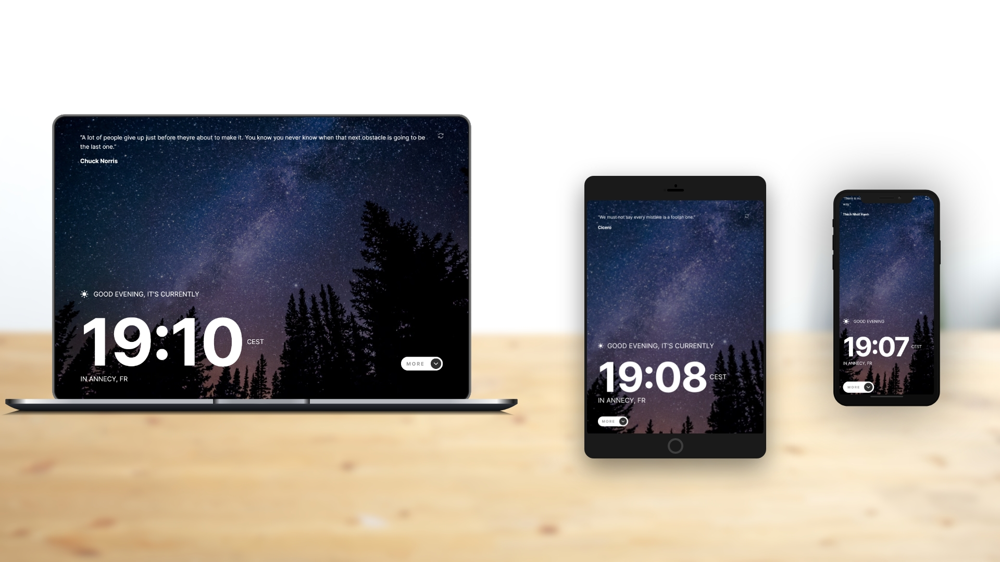

# Clock app

This is a solution to the [Clock app challenge on Frontend Mentor](https://www.frontendmentor.io/challenges/clock-app-LMFaxFwrM). Frontend Mentor challenges help you improve your coding skills by building realistic projects. 

## Table of contents

- [Clock app](#clock-app)
  - [Table of contents](#table-of-contents)
  - [Overview](#overview)
    - [The challenge](#the-challenge)
    - [Screenshot](#screenshot)
    - [Links](#links)
  - [Built with](#built-with)
  - [Author](#author)

## Overview

### The challenge

Users should be able to:

- View the optimal layout for the site depending on their device's screen size
- See hover states for all interactive elements on the page
- View the current time and location information based on their IP address
- View additional information about the date and time in the expanded state
- Be shown the correct greeting and background image based on the time of day they're visiting the site
- Generate random programming quotes by clicking the refresh icon near the quote

### Screenshot

### Links

- Live Site URL: [https://benjaminvillatte.github.io/fem-clock-app/](https://benjaminvillatte.github.io/fem-clock-app/)

## Built with

- Flexbox
- CSS Grid
- Mobile-first workflow
- CSS transitions
- [Vuejs](https://vuejs.org/) - JS library
- [axios](https://github.com/axios/axios) - JS library
- [Vuex](https://vuex.vuejs.org/) - JS library
- [World Time API](http://worldtimeapi.org/) to set the time based on the visitor's IP adress. This API will also be used for additional data, like the day of the year shown in the expanded state.
- [IP Geolocation API](https://freegeoip.app/) to set the city and country underneath the time.
- [Quotes API](https://github.com/lukePeavey/quotable) to get random quotes.

## Author

- Website - [Benjamin VILLATTE](https://benjaminvillatte.fr)

